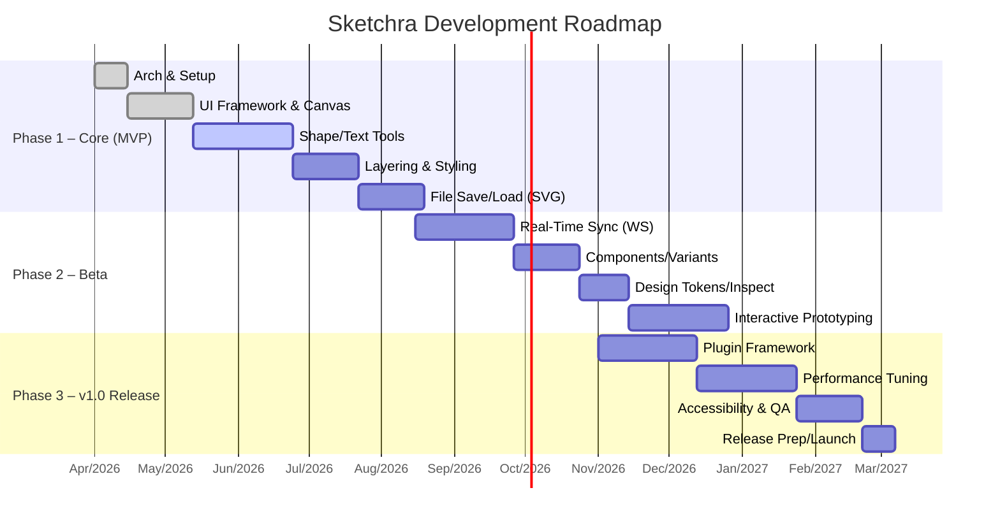

# Sketchra: A Roadmap for an Open-Source Figma Alternative

## Executive Summary  
Sketchra is envisioned as a free, open-source design and prototyping platform on par with Figma. We survey existing tools (Figma, Penpot, Lunacy, etc.) to derive a comprehensive feature list (vector editing, prototyping, components, real-time collaboration, versioning, plugins, performance, accessibility, import/export). Based on these, we define an MVP scope and a phased roadmap with milestones and deliverables. We specify team roles (PM, designers, frontend/back-end devs, QA), architecture options (web vs desktop, backend services), and recommended tech stacks (frontend frameworks, back-end frameworks, databases, real-time sync). We outline CI/CD/testing and code-quality standards, security and scalability measures, and OSS licensing with contributor guidelines. We also discuss community growth and monetization strategies that preserve free usage. Success metrics, risk analysis, and cost estimates complete the plan. Each point is backed by authoritative sources and official documentation.

## Existing Tools and Market Landscape  
**Figma** – Cloud-based SaaS with powerful vector editing, auto-layout (flexbox/grid), components, prototyping, plugins, and real-time multi-user editing【24†L224-L231】【19†L152-L161】. It automatically saves and maintains a full version history【57†L329-L331】. However, Figma is proprietary (closed-source), has usage limits on its free tier, and relies on a custom file format (.fig) and hosted infrastructure.  

**Penpot (by Kaleidos)** – A web-based, MIT-licensed design tool that closely mirrors Figma’s feature set. It supports components/variants, CSS Grid/Flex layouts, design tokens, and exports designs as code (SVG/CSS/HTML) via its Inspect panel【46†L321-L324】【46†L339-L342】. Penpot can be self-hosted for complete ownership and enterprise compliance【46†L139-L142】【7†L175-L183】. All features are free and open, with no team or file limits.  

**Lunacy (Icons8)** – A free desktop app for Windows/macOS/Linux (and now Web) with built-in Sketch import support. It offers real-time collaboration, offline mode, auto-layout, and AI-powered content (icons, photos, avatars, text generators)【36†L114-L122】. Lunacy is not open-source but is free for personal and commercial use.  

**Inkscape** – A mature GPL-licensed vector graphics editor (cross-platform). It excels at SVG vector drawing and advanced filters【17†L219-L227】, but lacks UI-specific features like prototyping or components. It is stable and open-source, but not designed for collaborative interface design.  

| Tool       | License         | Platforms           | Real-time Collab | Key Features                                              | Formats              | Cost    |
|------------|-----------------|---------------------|------------------|-----------------------------------------------------------|----------------------|---------|
| **Figma**  | Proprietary SaaS| Web (＋Desktop apps)| Yes              | Vector editing, auto-layout, prototyping, plugins【24†L224-L231】  | .fig (proprietary), SVG, PNG | Freemium |
| **Penpot** | Open (MIT)      | Web only            | Yes (WebSockets) | Components/variants, CSS Grid/Flex layouts, design tokens【46†L321-L324】, Inspect tab【46†L339-L342】 | .penpot, SVG, HTML/CSS | Free    |
| **Lunacy** | Free (Icons8)   | Win/macOS/Linux     | Yes              | Sketch import, AI tools, offline mode【36†L114-L122】       | .lunacy, .sketch, SVG, PNG | Free    |
| **Inkscape** | Open (GPL)    | Win/macOS/Linux     | No               | Vector primitives, filters, extensions【17†L219-L227】     | .svg, .png, .pdf     | Free    |

Penpot’s documentation highlights the advantages of open standards and no lock-in (self-hostable, open formats)【46†L139-L142】. Lunacy emphasizes working offline and on any device. Inkscape sets a high bar for vector editing but lacks collaborative and prototyping features. Sketchra should combine the strengths: high-performance web-based editing (like Figma) with open-source flexibility (like Penpot), offering both online collaboration and offline functionality.

## Core Features and MVP Scope  
Sketchra’s full feature set will include:  
- **Vector Editing:** Shape primitives, freehand/pen (Bezier) tool, boolean path operations, text with styling.  
- **Canvas & UI:** Layer panel, grouping, alignment guides/rulers, pan/zoom, color/style pickers.  
- **Layout Systems:** Auto-layout or constraint system (akin to CSS Flex/Grid) for responsive design【46†L321-L324】; customizable grids.  
- **Components & Variants:** Reusable symbols, component instances with variant overrides, style libraries (colors/typography).  
- **Prototyping:** Clickable frames, simple transitions/animations for previewing UX flows.  
- **Design Tokens & Code Export:** Named colors/fonts/metrics (tokens) and an “Inspect” mode that generates production-ready CSS/HTML/SVG【46†L339-L342】 to hand off to developers.  
- **Real-Time Collaboration:** Multi-user editing with live updates (using WebSockets or CRDT sync)【22†L58-L62】【19†L152-L161】; see cursors/edits from other users.  
- **Version Control:** Automatic saving and full version history (with the ability to branch and merge, similar to Figma’s branching model【57†L270-L273】【57†L329-L331】).  
- **Plugins/Extensibility:** API for custom plugins and integrations (future extension).  
- **Performance:** GPU-accelerated rendering (WebGL or WebGPU) to handle large, complex documents smoothly【24†L224-L231】.  
- **Accessibility:** Keyboard shortcuts, screen-reader labels, color-blind friendly palette options.  

**MVP (Minimal Viable Product) Scope:** Focus on essentials for initial release. This includes a basic editable canvas with core shapes, text, and layers; style editing (fills, strokes); and file open/save (e.g. SVG import/export). Features like components, prototyping, and real-time collab can be scaled down or introduced in Phase 2. For example, MVP might only allow single-user editing with manual file sharing, then add live sync later. We prioritize items by value:

- (1) Core Canvas & Shapes – essential drawing tools.  
- (2) Layering & Styling – organize and style elements.  
- (3) File I/O – save/load, export to PNG/SVG.  
- (4) UI Layout Basics – grids, snap.  
- (5) Undo/History – basic undo stack.  
- (6) Collaboration Backbone – set up architecture (WebSocket server, document model) for later use.  

Subsequent priorities (for full release) include components/variants, prototyping engine, design tokens/inspect, plugin framework, and performance tuning. The feature set is informed by Penpot and Figma guides (e.g. tokens and layouts【7†L191-L194】【46†L321-L324】) and community needs.

## Development Roadmap and Phases  
We propose a multi-phase timeline (assuming open-ended schedule; sample duration ~9 months):



- **Phase 1 (MVP, ~3–4 mo):** Deliver *Sketchra Alpha* with core features (basic editor, single-user mode). Internal testing and initial documentation.  
- **Phase 2 (Beta, ~3 mo):** Enable collaboration (WebSocket sync prototype), components/variants, tokens/inspect, and prototyping. Release a *public Beta* for feedback.  
- **Phase 3 (Release, ~3 mo):** Build plugin system, optimize performance, finalize accessibility/localization, and complete documentation. Conduct final QA and launch *Sketchra v1.0*.  

**Phase Deliverables:**  
- *Alpha (Phase 1):* Core editing functionality; minimal feature set.  
- *Beta (Phase 2):* Collaboration working, advanced features present (usable if not polished).  
- *v1.0 (Phase 3):* Full feature set, stable release, developer docs and onboarding completed.  

**Issue Templates & Release Checklist:** In tandem, we will set up GitHub guidelines. For example, include ISSUE/PR templates (bug report: steps to reproduce, expected vs actual, environment; feature request: use case, proposed solution; PR template: summary, linked issue, checklist)【30†L154-L162】. A release checklist (version bump, changelog updated, tests passed) ensures each phase’s delivery is complete.

## Team Roles and Hiring Plan  
A core team might include:  
- **Product Lead:** Defines vision, backlog, and coordinates the project.  
- **UI/UX Designer:** Crafts the editor’s interface and user experience.  
- **Frontend Engineers (2–3):** Implement the canvas, tools, and UI (likely using React/Svelte + WebGL).  
- **Backend Engineers (1–2):** Build the API, real-time server, and database models.  
- **QA/DevOps Engineer:** Sets up CI/CD, writes automated tests, and manages hosting.  
- **Community/Docs Specialist:** Maintains docs, contribution guides, and engages users (may be part-time initially).

We assume initial hiring of ~5 people, expanding as needed. Emphasis on developers with experience in web graphics, real-time systems, and open source. Contributors from the community (open-source volunteers) will complement core staff, especially after establishing strong onboarding docs.

## Technical Architecture and Stack  
**Overall Architecture:** Sketchra will be a client-server web app. The browser front end (React or Svelte with TypeScript) handles the canvas and UI. The backend (Node.js or Rust service) provides a REST/GraphQL API and WebSocket sync. For example, Penpot’s architecture (ClojureScript+React frontend, Clojure backend, PostgreSQL DB)【21†L45-L52】 illustrates this SPA model. We will similarly use a modern JS framework for the front end and a robust back end with a database.  

```mermaid
flowchart LR
    A[Browser Client (React/WebGL)] -->|HTTP API| B[Backend Server]
    A -->|WebSocket| C[Real-Time Sync Service]
    B --> D[(Database)]
    C --> D
    B --> E[(Object Storage)]
    C --> E
```

- **Frontend:** React/Svelte SPA. All rendering is GPU-accelerated (WebGL/WebGPU). Figma built a custom WebGL renderer in asm.js/WebAssembly for smooth vector graphics【24†L224-L231】; we may reuse existing libraries or similar techniques.  
- **Backend:** Stateless server instances (Node.js with Express/Koa or a Rust/Go service) behind a load balancer. Real-time editing uses WebSockets (one per document) to broadcast edits【22†L58-L62】. We may employ a CRDT (Yjs or Automerge) to merge concurrent changes.  
- **Storage:** A relational DB (PostgreSQL) or NoSQL (MongoDB) stores projects, user data, etc. Large files and design exports reside in object storage (e.g. AWS S3). Penpot uses PostgreSQL for persistence【21†L45-L52】.  
- **Collaboration Engine:** Each document’s state may be kept in-memory on the server (like Figma’s document processes)【19†L152-L161】. Edits are sent as operations. We will explore libraries for conflict-free editing to simplify syncing.  
- **Offline Mode:** Optionally, an Electron desktop app or ServiceWorker support for offline editing (like Lunacy’s offline mode【36†L114-L122】), with sync when reconnected.  

**Tech Stack (recommended):** Frontend in TypeScript + React (or SvelteKit) with a canvas/WebGL library. Backend in Node.js (TypeScript) or Rust for performance. PostgreSQL for relational data. Yjs (JavaScript) or a custom WebSocket/CRDT server for real-time sync. Deploy in Docker containers on Kubernetes or cloud VMs.  

**Code Quality and Standards:** Enforce linting (ESLint/Prettier) and code reviews on GitHub. Maintain a style guide (e.g. Airbnb JS style). All code changes must have tests. We will use GitHub Actions or GitLab CI to run builds, linters, and tests on every PR. Code coverage (e.g. 70–80% minimum) and static analysis (Snyk, CodeQL) will track quality.

## CI/CD, Testing, and Standards  
To ensure reliability, implement an automated pipeline:  
- **CI:** On each push/PR, run `npm test` (unit/integration tests) and linters. Build the app to catch syntax errors. If any step fails, the PR is blocked.  
- **CD:** Merges to main trigger deployment to a staging environment. After validation, deployments to production can be manual or automated (Git tags, releases).  
- **Testing:** Write unit tests for core logic (geometry math, data transforms). Use front-end testing (Jest/RTL) and backend testing (Mocha, Jest, or Rust’s test suite). Add end-to-end tests (Cypress or Playwright) simulating user actions. Aim for automated regression tests on every build.  
- **Templates & Guidelines:** Include CONTRIBUTING.md with contribution process and templates for issues/PRs【30†L154-L162】. For example, a bug report template (steps, expected behavior, environment) and a feature request template. Provide a PR template that asks for a summary, issue link, and checklist (tests/doco updated).  
- **Release Checklist:** Before each release, update version numbers, ensure all tests pass, update CHANGELOG, and verify all docs are current. For consistency, we will maintain a documented release checklist (version, tagging, publishing binaries/assets, etc.).  

## Collaboration and Real-Time Sync  
Sketchra’s differentiator is real-time multi-user editing:  
- **WebSocket Sync:** Each open design document connects to a server via WebSocket. Clients send edit operations (e.g. “move shape”, “add text”), and the server relays them to other clients. Penpot’s model is exactly this: a persistent WebSocket per file broadcasts edits and presence info【22†L58-L62】.  
- **Data Model:** We will represent the document as a shared data structure. Off-the-shelf CRDTs (like Yjs) can automatically merge concurrent edits without conflict. Figma’s engineers chose a custom merge engine instead of generic OT/CRDT【19†L113-L121】, but given our open-source context, using Yjs (with a websocket provider) is a practical path.  
- **Offline Edits:** Clients should be able to queue changes if disconnected and merge on reconnection. Figma’s blog mentions clients can go offline and reapply edits upon reconnect【19†L169-L174】. We will implement a simple version of this (buffer changes, fetch latest doc, replay).  
- **Versioning and Branching:** Include version history and branching similar to Git. Designers can create a branch (copy of the file) to experiment. When ready, they merge it. After merge, the branch is archived (users can revert to it if needed)【57†L270-L273】【57†L329-L331】. This workflow prevents conflicts and preserves earlier ideas.  
- **Collaboration UI:** Show live cursors, selection highlights, and usernames (as Figma does) so users feel the shared presence. Provide voice/video links or chat integration optionally.

## Security and Scalability  
- **Security:** Use HTTPS for all traffic. Authenticate users (OAuth2 or SSO). Enforce granular permissions (owner/editor/viewer roles). Sanitize and validate all input data (shapes, text) to prevent XSS. Penpot emphasizes that self-hosted open-source allows organizations to meet their security policies【7†L175-L183】; Sketchra should similarly support private deployment. Encrypt sensitive data at rest if required, and implement regular security audits (use tools like OWASP ZAP or Snyk).  
- **Scalability:** Architect for growth. Run multiple backend/sync instances with a load balancer. Partition documents across servers (e.g. sticky sessions by file ID) to scale WebSocket load. Use a managed database that can scale vertically or horizontally. Cache frequently accessed data in Redis. Figma’s approach of one server per document【19†L152-L161】 can be emulated via container orchestration (Kubernetes pods). Monitor load (CPU/RAM per server, DB connections) and configure auto-scaling rules. Store large assets in a CDN or object store to offload traffic.  

## Licensing and Contribution Guidelines  
Choose a well-known open license. **Apache 2.0** or **MIT** are recommended for code【53†L100-L108】. Apache 2.0 includes an explicit patent grant (appealing to businesses)【53†L148-L156】. If stronger copyleft is desired to force any service changes to be open, **AGPLv3** is an option, but MIT/Apache maximize adoption.  

Set up GitHub community files: include a LICENSE file, a CONTRIBUTING.md, and a Code of Conduct. The CONTRIBUTING guide should explain how to file issues and PRs (GitHub advises templates for this)【30†L154-L162】. For example, we will include ISSUE_TEMPLATE and PULL_REQUEST_TEMPLATE under `.github/`, guiding users with sections (see GitHub’s documentation on templates【30†L154-L162】). Enforce a DCO or CLA if desired for contributors.  

Sample issue templates might include:  
- **Bug Report:** Description, Steps to Reproduce, Expected vs Actual, Environment (browser/OS).  
- **Feature Request:** Description, Use Case, Proposed Approach, Mockup/Sketch (if available).  
- **Pull Request Template:** Summary of changes, related issue/PR link, checklist (tests added, docs updated, code style).  

These help maintain quality and triage efficiency.

## Community Growth and Monetization  
To build a community, we will: create discussion forums/Discord, publish development roadmaps and tutorials, and encourage contributions (e.g. “good first issue” tags). Hosting webinars or hackathons can attract users. Transparent planning (like this report) and developer diaries build trust, as seen with Penpot’s open process【7†L175-L183】.

**Monetization (free core):** Maintain Sketchra’s core as free/open, while generating revenue via:  
- **Hosted Service:** Offer Sketchra Cloud hosting (SaaS) with subscriptions for teams. For example, Penpot charges a flat fee for enterprise hosting (no per-user charge)【7†L228-L236】. Sketchra could similarly sell managed hosting or support contracts.  
- **Enterprise Support:** Provide paid support/training for organizations running their own Sketchra instance.  
- **Premium Add-ons:** Keep all base features free, but sell value-added services (e.g. advanced AI plugins, private cloud deployment kits).  
- **Donations/Sponsorship:** Set up Open Collective or GitHub Sponsors. Highlight corporate sponsors (like some open-source projects do) in documentation.  

This open core model ensures anyone can use and modify Sketchra freely, while funding development through paid services.

## Onboarding, Documentation, and Release Process  
**Developer Onboarding:** Provide a clear `README` with setup instructions (cloning, dependencies, running dev servers). Include an architecture overview (drawn from [21†L45-L52]), coding style guidelines, and a list of starter issues. New developers should be guided to run a simple “Hello, world” plugin or fix a small bug first.  

**Documentation:** Maintain a wiki or site with user documentation (tutorials, feature usage) and developer docs (architecture, API references). Penpot’s help center shows how separate docs can be organized for user vs developer audiences【21†L45-L52】.  

**Release Management:** Before each release, follow a checklist: update version numbers, ensure all tests pass, merge in pending PRs, update CHANGELOG, and run final end-to-end tests. Tag the release in GitHub and publish release notes. A pre-release in beta channels can catch issues early.  

## Success Metrics  
Key indicators of Sketchra’s success include:  
- **Adoption:** Number of active users/projects, downloads of the desktop app (if any), self-host instances running.  
- **Community Activity:** GitHub stars/forks, number of contributors, and frequency of commits/issues.  
- **Usage:** Sessions of collaborative editing, documents created, projects completed.  
- **Quality:** Bugs reported vs resolved, uptime (service availability), latency of core operations (target <500ms per action).  
- **Satisfaction:** User feedback (surveys, NPS, testimonials).  
- **Financial:** If monetized, revenue from hosting/support, and funding raised (sponsorships, grants).  

For example, targets might be “500 active organizations by Year 2” and “50 community contributors”.

## Risk Analysis  
- **Technical Complexity:** Building a performant, collaborative vector editor is hard (Figma’s own blog details the effort in rendering and syncing)【24†L224-L231】【19†L152-L161】. *Mitigation:* Prototype critical parts early (rendering engine, sync logic), leverage existing libraries (WebGL frameworks, CRDT engines), and allocate buffer time.  
- **Performance/Scalability:** Large designs or heavy user load could bog down the app. *Mitigation:* Optimize the graphics pipeline (tile-based updates, minimal redraw), and design the backend to autoscale. Load testing should start in Phase 2.  
- **Security/Privacy:** Storing design IP could raise security concerns. *Mitigation:* Follow best security practices (TLS, input sanitization). Emphasize that self-hosting is an option. Regular audits and use of safe dependencies will reduce risk.  
- **Adoption Risk:** Competing with established tools may limit uptake. *Mitigation:* Focus on niches valuing openness (e.g. educational institutions, privacy-sensitive organizations) and promote interoperability (open formats).  
- **Community Engagement:** If the community doesn’t grow, project momentum stalls. *Mitigation:* Maintain transparency, appreciate contributors, and make contribution easy (good docs, responsive maintainers).  
- **Funding:** Without sustainable revenue, development could lag. *Mitigation:* Pursue grants (e.g. EU Digital Commons programs), early sponsorships, and the business models above to ensure ongoing resources.

## Cost Estimates  
This is a rough budget assuming a small dedicated team and cloud hosting:  
- **Salaries/Personnel:** 5 full-time developers/designers ~ \$500K/year (assuming \$100K each). Adjust for actual hiring costs in your region.  
- **Infrastructure:** Basic cloud hosting (a few servers, DB, storage) might run \$1.2K–\$15K/year, per industry surveys【55†L229-L232】. Initial budget: \$5K–\$20K/year.  
- **Tools & Other:** CI/CD services, domains, minor marketing ~\$5K/year.  
- **Total (Year 1):** \$510K–\$525K (largely salaries). This aligns with estimates that a web app’s development can cost tens of thousands of dollars plus hosting【55†L142-L146】【55†L229-L232】. Leveraging volunteers and sponsors can offset some costs, but core funding is required for a stable team.  

**Sources:** We prioritized primary sources and official docs. For example, Penpot’s site details its architecture and pricing model【21†L45-L52】【7†L228-L236】, and Figma’s engineering blog explains its real-time engine【19†L152-L161】【24†L224-L231】. GitHub’s Open Source Guides advise on licensing and contribution templates【30†L154-L162】【53†L100-L108】. Industry articles provide cost benchmarks【55†L142-L146】【55†L229-L232】. These informed each section above. 

